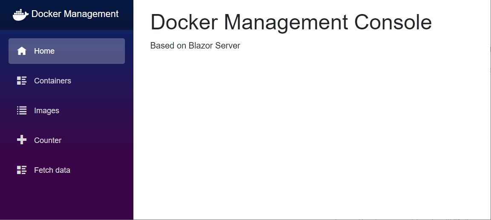
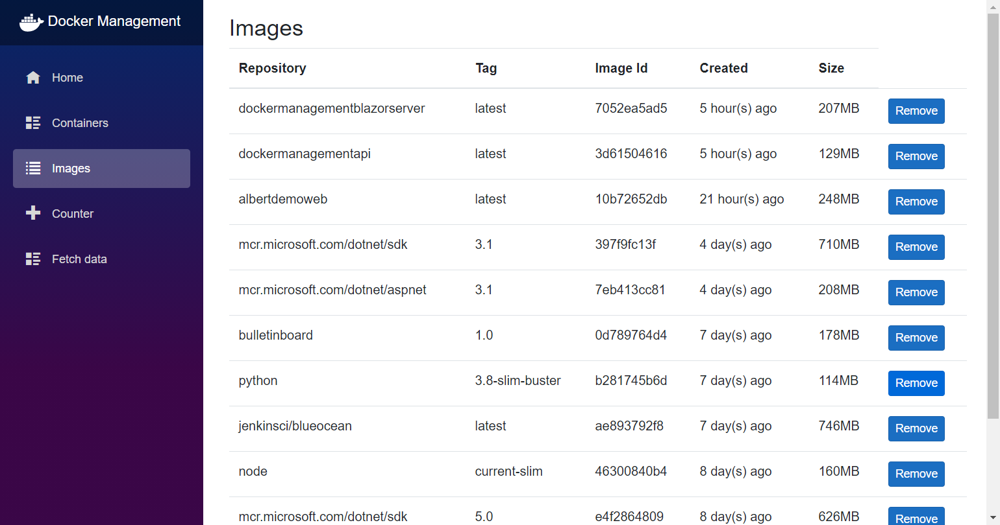
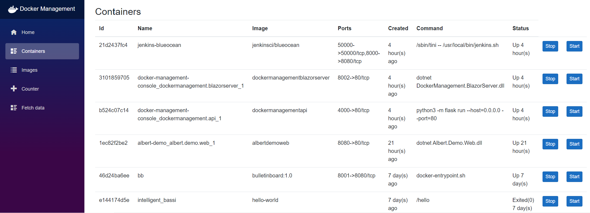

# dockerapi

This project is a docker mangagement console that can be used to list the containers and images on the docker host. This project include server and client. The server is based on `python+flask`, the client is based on `blazor server`.



### Server

The server operate docker engine by using [Docker Engine SDK for Python](https://docs.docker.com/engine/api/sdk/#python-sdk), see the full [Docker Enginen Python SDK](https://docker-py.readthedocs.io/en/stable/)

Install the following package before start the project:
```bash
pip install docker
```

```bash
pip install Flask
```

```bash
pip install flask-cors
```

start server:

```bash
flask run --host=0.0.0.0
```

If open the code at the end of `app.py`:

```python
'''
if __name__ == "__main__":
    app.run(host='0.0.0.0', port=parse_start_port())
'''
```
run shell file `run.sh`
```bash
#!/bin/bash

nohup python3 app.py 4000 >out.log 2>&1 &
```

`nohup` start the app in background, `>out.log` output the log to file log.log, `2>&1` redirect all stdout and error to log.log file.

### Client

The client requst the docker images and containers information from server and list on page.

docker images:

Removing image by button `Remove`.

docker containers:


Starting and stoping container by button `Start` and `Stop`.
